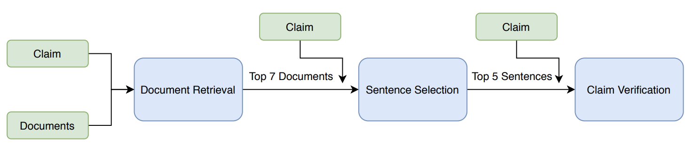

## Neural Networks for NLP Project: Fact Extraction and Verification

### Authors
Aditya Anantharaman (AndrewID: adityaan)  
Derik Clive Robert (AndrewID: dclive)  
Abhinav Khattar (AndrewID: akhattar)  

### About the Project
The increasing cases of manipulation of facts, misleading information and unverified claims make automatic fact verification an important task. The Fact Extraction and Verification (FEVER) Shared Task provides a large-scale dataset of claims and Wikipedia documents as evidence to verify these claims. In this work, we tackle this task by building an end-to-end neural model which given a claim, extracts relevant documents, then matches informative sentences in these documents with the claim to verify the claim. We build upon the BERT based approach proposed by Soleimani et al. and strengthen the claim verification module using Multi-Task Deep Neural Networks (MT-DNN) and Stochastic Answer Networks (SAN) in addition to multi-hop evidence reasoning. We show that our approach is able to outperform even the BERT-Large model proposed by Soleimani et al. using the BERT-Base architecture in terms of label accuracy which showcases the effectiveness of our improved claim verification model. 

### Pipeline

### General
The repo contains .py files required to run the code.  
To replicate Soleimani et al. results, run code in the following order:  
1. [doc_retrieval.py](https://github.com/aditya5558/BERT-FEVER-Task/blob/master/SOTA%20Reimplementation/doc_retrieval.py): retrieves docs using the MediaWiki API  
2. [sentence_retrieval.py](https://github.com/aditya5558/BERT-FEVER-Task/blob/master/SOTA%20Reimplementation/sentence_retrieval.py): retrieves top 5 sentences for every claim  
3. [claim_verification.py](https://github.com/aditya5558/BERT-FEVER-Task/blob/master/SOTA%20Reimplementation/claim_verification.py): classifies the top 5 sentences for every claim  

Files for other specific implementations inside respective folders.

### Dev Set Results

|Model |Fever Score (\%)|Label Accuracy (\%) |
|:-:|:-:|:-:|
 |BERT-Pointwise (Soleimani et al.) | 71.38 | 73.5|
 |BERT-Large (Pointwise + HNM) (Soleimani et al.) | **72.42** | 74.59|
|BERT-Pointwise re-implementation | 68.11 | 71.13 |
|XLNet | 69.13 | 72.96|
|RoBERTa | 69.89 | 73.11|
|RoBERTa Multi-hop | 70.55 | 74.95|
 |MT-DNN Multi-hop | 70.02| 74.82|
 |MT-DNN + SAN Multi-hop | 70.52| **75.17**|

### Reference
Repo inspired by:  
[BERT for Evidence Retrieval and Claim Verification](https://arxiv.org/pdf/1910.02655.pdf) by Soleimani et al.
